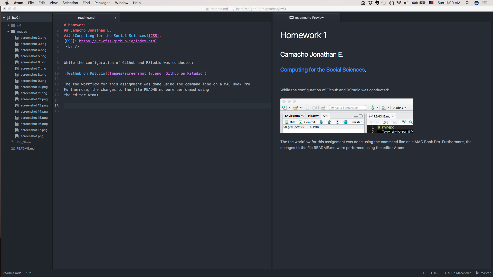
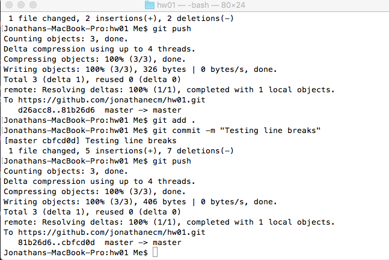
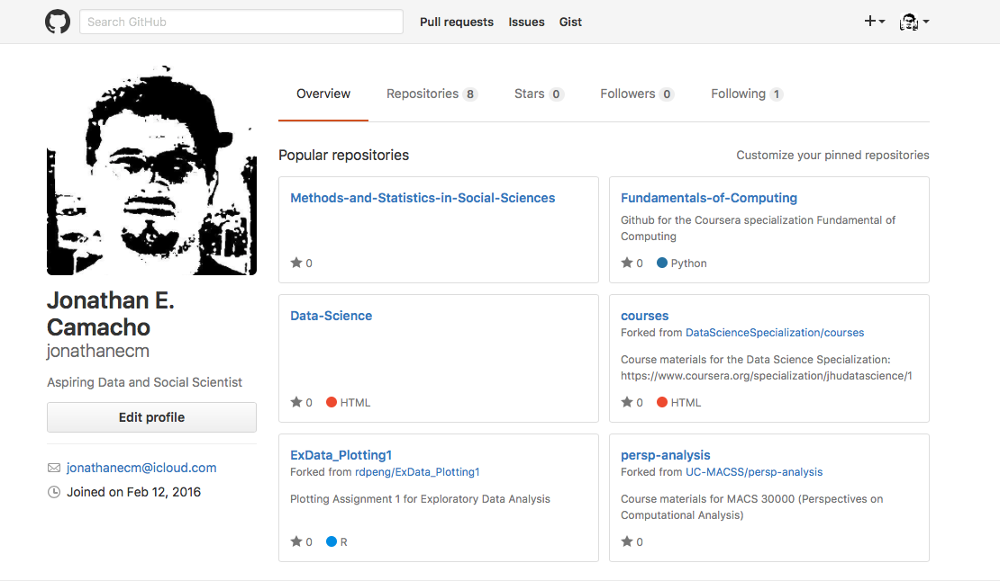

# Homework 1
## [Computing for the Social Sciences][CSS].
[CSS]: https://uc-cfss.github.io/index.html
**Camacho Jonathan E.**
  
### Content
- Description of how Changes to README.md were made.
- Reflection of installation and use of Github and Markdown syntax.

### Description of how Changes to README.md were made.  
While the configuration of Github and RStudio was conducted:

The the workflow for this assignment was done using the command line on a MAC Book Pro. Furthermore, the changes to the file README.md were performed using
the editor Atom:

After changes were made to the README.md file, the changes were staged on git (using the command *git add .* on shell) commited (*git commmit -m "message"*), and pushed to Github server (*git push*).

Finally a pull request as perform through the Github web page.

### Reflection of installation and use of Github and Markdown syntax.

Git and Github are amazing tools for collaborating when developing software. However, in some occasions, configuring them correctly can be a slightly complex process; for example, when different applications use git, or when trying to use several Github accounts.

At the beginning of this course, I already have a Github account.

However, I opened an Educational Github account. When I pointed my local repository to the repository on the new Github account, git kept throwing  the error message “Error 403 Access Denied/Forbidden.” After researching for a few minutes, I figured out that is a message that git throws when it cannot access the Github repository online because of wrong credentials.
I tried to hack the problem for a while (revising the git's .config files, authenticating the account several times, and I cache the credentials), but the local repository continued pointing to my old one. After reading several pages, such as [Stackoverflow][SO] and realizing that others have struggled with the same problem with not luck, I decided to go back to my old repository.

 I faced another issue when trying to configure Github and RStudio. When trying to create a project with a version control (Git), RStudio kept telling me that it could not find the executable file for Git. Luckily, I was able to determine that my installation of PyCharm seems to have changed the executable file from /usr/bin/git to /usr/local/git/bin/git, so I just redirected RStudio to this directory path.

Finally, one particular tutorial that was very useful was [Git Tutorial][GitT] This is a step-by-step tutorial go Git basics.

A final thought, a hacker perspective will take you along way when trying to troubleshoot programing and version control issues.

[SO]:http://stackoverflow.com
[GitT]:https://try.github.io/levels/1/challenges/1]
