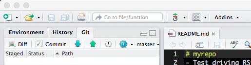

# Homework 1
## Computing for the Social Sciences
##### Camacho Jonathan E.

I start my morning with a cup of coffee and
[The New York Times][NY Times].

[ny times]: http://www.nytimes.com/

While the configuration of Github and RStudion was conducted:

the the workflow for this assignment was done using the command line on a MAC Book Pro. Furthermore, the changes to the file README.md were performed using
the editor Atom.
